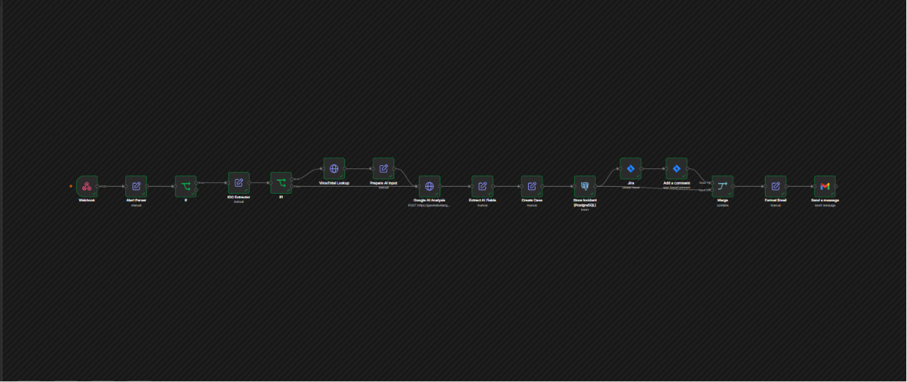
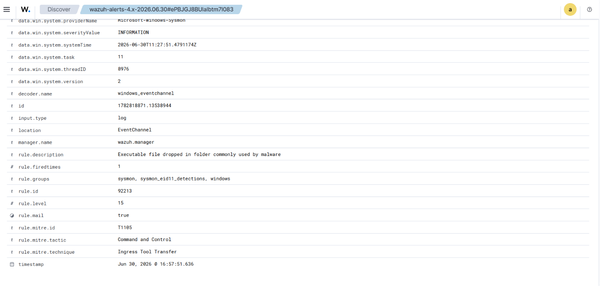
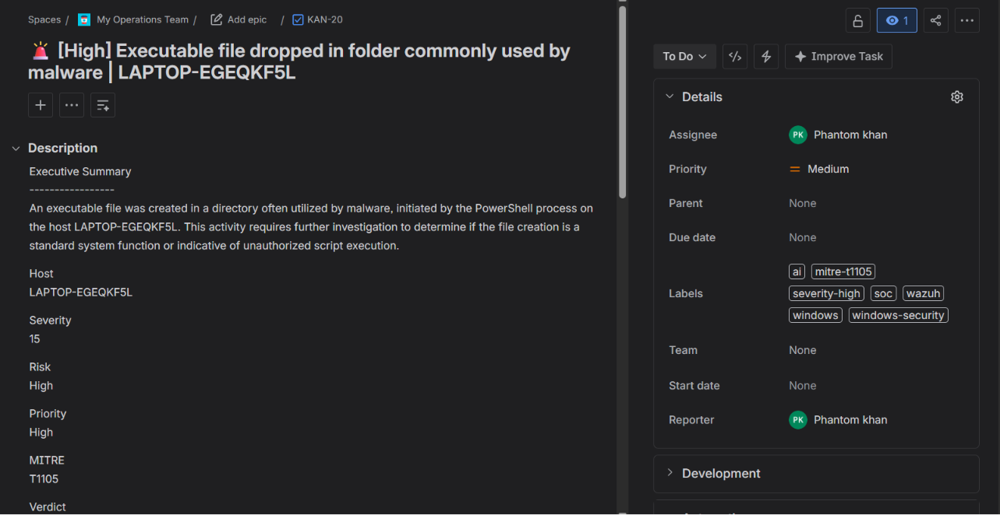
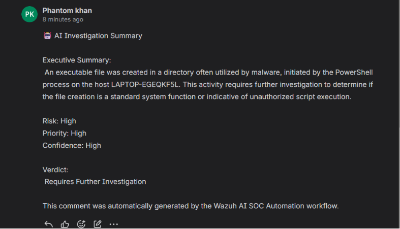
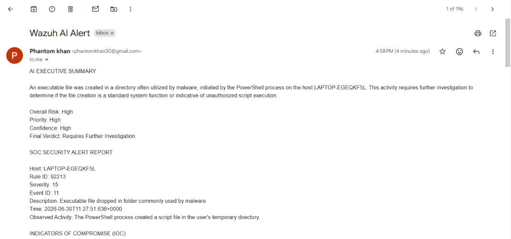
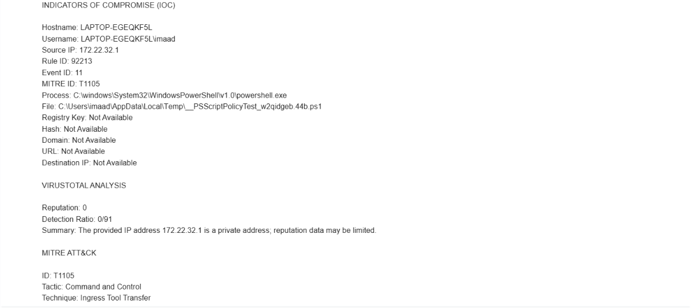
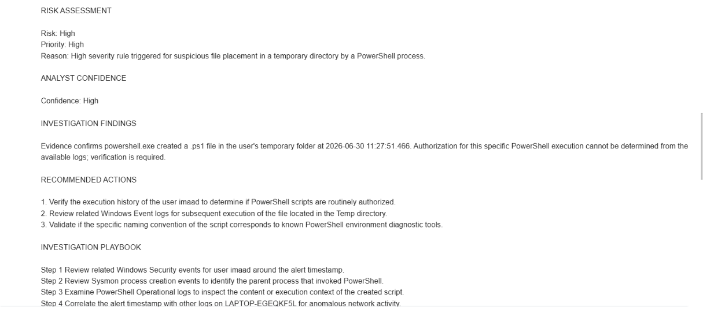
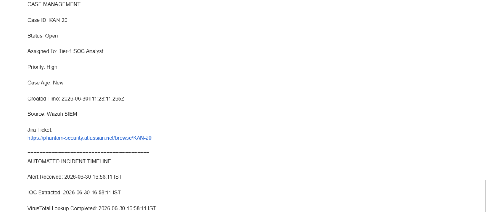
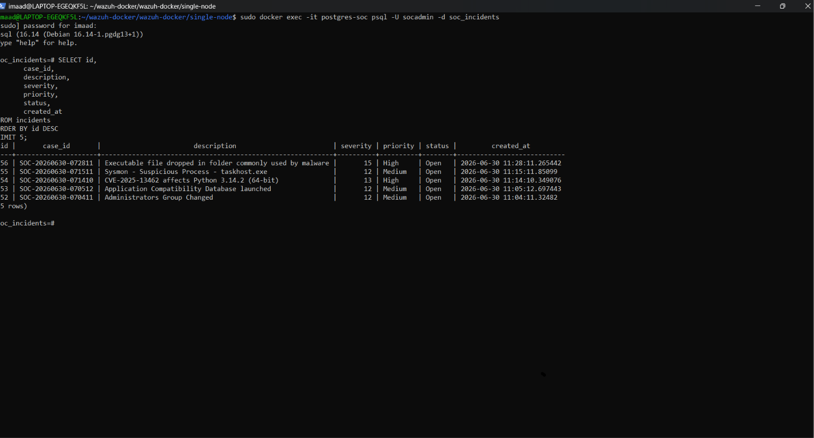

# 🤖 AI-Powered SOC Automation with Wazuh, n8n, Jira & Google Gemini

> An end-to-end AI-driven Security Operations Center (SOC) automation workflow that automatically detects security alerts in Wazuh SIEM, enriches them with VirusTotal intelligence, analyzes them using Google Gemini AI, creates Jira incidents, stores investigation results in PostgreSQL, and sends email notifications to security analysts.

---

## 📌 Project Overview

Modern Security Operations Centers receive thousands of security alerts every day. Manual investigation of each alert is time-consuming and increases Mean Time To Respond (MTTR).

This project demonstrates how Security Operations can be automated using Wazuh SIEM, n8n, Google Gemini AI, VirusTotal, Jira, PostgreSQL, and Gmail.

The workflow automatically:

- Detects high-severity alerts from Wazuh SIEM
- Extracts Indicators of Compromise (IOCs)
- Performs VirusTotal reputation checks
- Generates an AI-powered investigation summary using Google Gemini
- Creates an incident in Jira
- Stores investigation details in PostgreSQL
- Sends an email notification to SOC analysts

This project simulates how a modern AI-assisted SOC can reduce manual effort while improving incident response efficiency.

---

# 🛠️ Tech Stack

| Category | Technologies |
|----------|--------------|
| SIEM | Wazuh |
| Automation | n8n |
| AI | Google Gemini |
| Threat Intelligence | VirusTotal |
| Ticketing | Jira |
| Database | PostgreSQL |
| Email Notifications | Gmail SMTP |
| Operating System | Ubuntu Linux |
| Containerization | Docker |
| Version Control | Git & GitHub |

---

# 🏗️ Workflow Architecture

The automation workflow follows the sequence below:

1. Wazuh detects a high-severity security alert.
2. The alert is sent to n8n using a Webhook.
3. n8n extracts important IoCs (IP address, hash, domain, etc.).
4. VirusTotal checks the reputation of the extracted IoCs.
5. Google Gemini AI analyzes the alert and generates an investigation summary.
6. A Jira incident ticket is created automatically.
7. Investigation details are stored in PostgreSQL.
8. A notification email is sent to the SOC analyst.
9. The analyst reviews the Jira ticket and takes further action.

---

# ✨ Key Features

- 🚨 Automated alert ingestion from Wazuh SIEM
- 🔍 Automatic IoC extraction (IP, Domain, URL, Hash)
- 🌐 VirusTotal threat intelligence enrichment
- 🤖 AI-powered investigation using Google Gemini
- 🎫 Automatic Jira incident creation
- 🗄️ PostgreSQL database storage for investigations
- 📧 Email notification to SOC analysts
- ⚡ End-to-end no-code automation using n8n
- 📊 Reduced Mean Time To Detect (MTTD) and Mean Time To Respond (MTTR)
- 🔒 Suitable for Blue Team and SOC automation demonstrations

---

# 📂 Project Structure

```text
AI-SOC-Automation-Wazuh-n8n-Jira-Gemini/
│
├── README.md
├── LICENSE
├── AI-SOC-Automation-Workflow-SOP.docx
│
└── screenshots/
    ├── 01-n8n-workflow-overview.png
    ├── 02-wazuh-high-severity-alert.png
    ├── 03-jira-case-created.png
    ├── 04-ai-investigation-comment.png
    ├── 05-email-notification.png
    ├── 06-ai-investigation-report.png
    ├── 07-postgresql-incident-database.png
    ├── 08-final-n8n-workflow.png
    └── ...
```

---

# ⚙️ End-to-End Workflow

The AI-powered SOC automation pipeline follows the workflow below:

### 1. Alert Detection
- Wazuh SIEM continuously monitors endpoint activity using Sysmon and Windows Event Logs.
- When a suspicious event matches a detection rule, Wazuh generates a security alert.

### 2. Alert Ingestion
- The alert is sent to n8n using a Webhook.
- n8n receives and parses the raw JSON payload.

### 3. IOC Extraction
- Important Indicators of Compromise (IOCs) such as IP addresses, usernames, file paths, processes, Event IDs, Rule IDs and MITRE ATT&CK mappings are extracted.

### 4. Threat Intelligence Enrichment
- Extracted IP addresses are queried against VirusTotal.
- Reputation and detection information are added to the investigation.

### 5. AI Investigation
- Google Gemini AI analyzes the enriched alert.
- AI generates:
  - Executive Summary
  - Risk Assessment
  - Priority
  - Confidence Level
  - Investigation Findings
  - Recommended Actions
  - Investigation Playbook
  - Final Verdict

### 6. Incident Management
- A unique Case ID is generated.
- Incident details are stored in PostgreSQL.
- A Jira ticket is automatically created.
- AI Investigation Summary is added as a Jira comment.

### 7. Analyst Notification
- A professionally formatted email containing the investigation report and case details is automatically sent to the SOC analyst.

### 8. Investigation
- The SOC analyst reviews the Jira ticket.
- Validates the AI findings.
- Performs additional investigation if required.
- Takes appropriate response actions.

---

# 📸 Project Demonstration

The following screenshots demonstrate the complete end-to-end SOC automation workflow.

## 1️⃣ n8n Workflow Overview



The complete automation workflow built using n8n, integrating Wazuh SIEM, VirusTotal, Google Gemini AI, PostgreSQL, Jira, and Gmail.

---

## 2️⃣ High Severity Alert Detection



Wazuh detects a high-severity security alert generated from monitored endpoint activity and forwards it to the automation workflow.

---

## 3️⃣ Automatic Jira Case Creation



A Jira incident is automatically created with the alert details, severity, investigation summary, and recommended actions.

---

## 4️⃣ AI Investigation Comment



Google Gemini AI generates an investigation summary and automatically posts it as a comment on the Jira incident.

---

## 5️⃣ Email Notification



A formatted investigation report is automatically emailed to the SOC analyst with alert details and AI recommendations.

---

## 6️⃣ AI Investigation Report – Part 1



The first section of the AI-generated investigation report containing the executive summary, alert analysis, and risk assessment.

---

## 7️⃣ AI Investigation Report – Part 2



The second section includes detailed findings, Indicators of Compromise (IOCs), MITRE ATT&CK mapping, and recommended actions.

---

## 8️⃣ AI Investigation Report – Part 3



The final section contains the investigation conclusion, confidence level, response playbook, and final verdict.

---

## 9️⃣ PostgreSQL Incident Storage



The complete incident, AI investigation, and metadata are automatically stored in PostgreSQL for auditing, reporting, and future analysis.

# 🎯 Skills Demonstrated

This project demonstrates practical SOC Analyst and Security Automation skills, including:

- Security Information and Event Management (SIEM)
- Security Alert Analysis
- Incident Response Workflow Automation
- Threat Intelligence Enrichment
- AI-Assisted Security Investigation
- Indicators of Compromise (IOC) Analysis
- MITRE ATT&CK Framework Mapping
- Jira Incident Management
- PostgreSQL Database Integration
- API Integration and Automation
- Email Notification Automation
- Security Operations Center (SOC) Processes
- No-Code Workflow Automation using n8n

---

# 🛠️ Technologies Used

| Technology | Purpose |
|------------|---------|
| Wazuh SIEM | Security monitoring and alert generation |
| n8n | Workflow automation platform |
| Google Gemini AI | AI-powered investigation and analysis |
| VirusTotal API | Threat intelligence enrichment |
| Jira | Incident ticket management |
| PostgreSQL | Incident database storage |
| Gmail API | Email notifications |
| Windows Sysmon | Endpoint event collection |
| Windows Event Logs | Security event monitoring |

---


